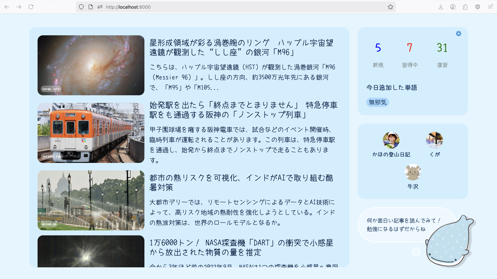

jdash - japanese dashboard for immersion

Scrapes the latest articles from a few of the sites I read, also keeps track of new vocab words mined today, and shows me how many remaining new/relearn/review Anki cards I have left for the day. Plus shortcuts to some YT channels.

